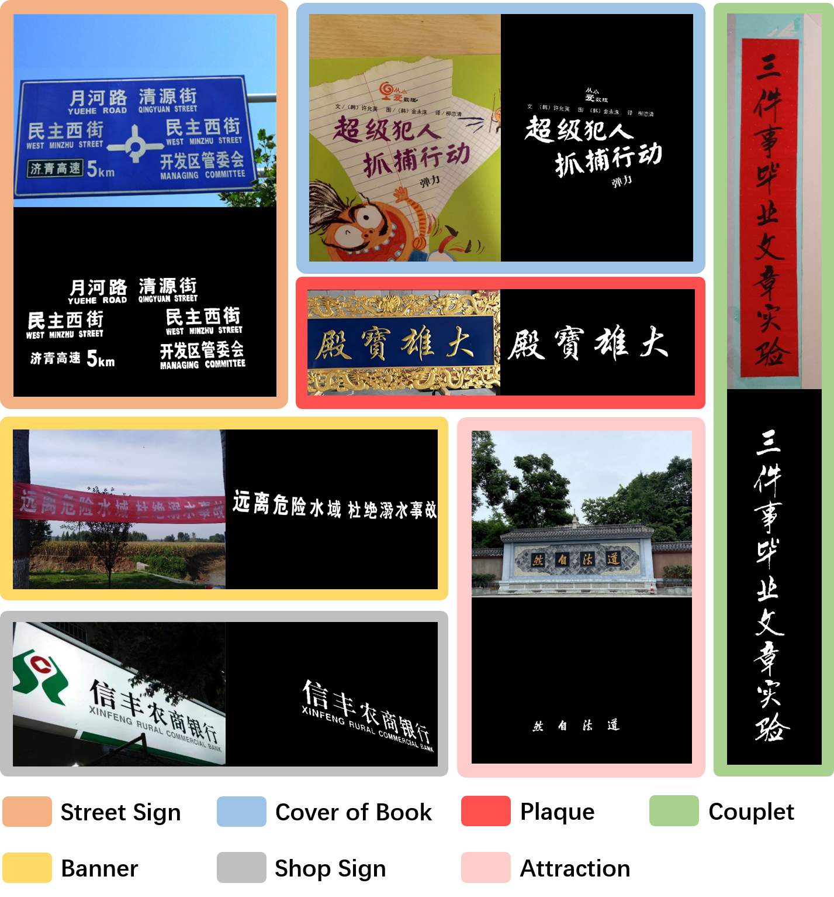
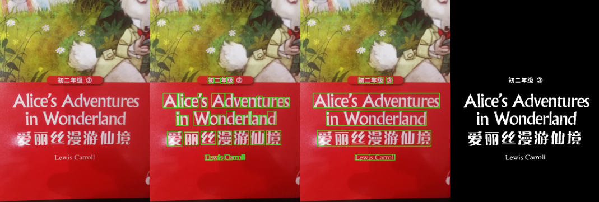
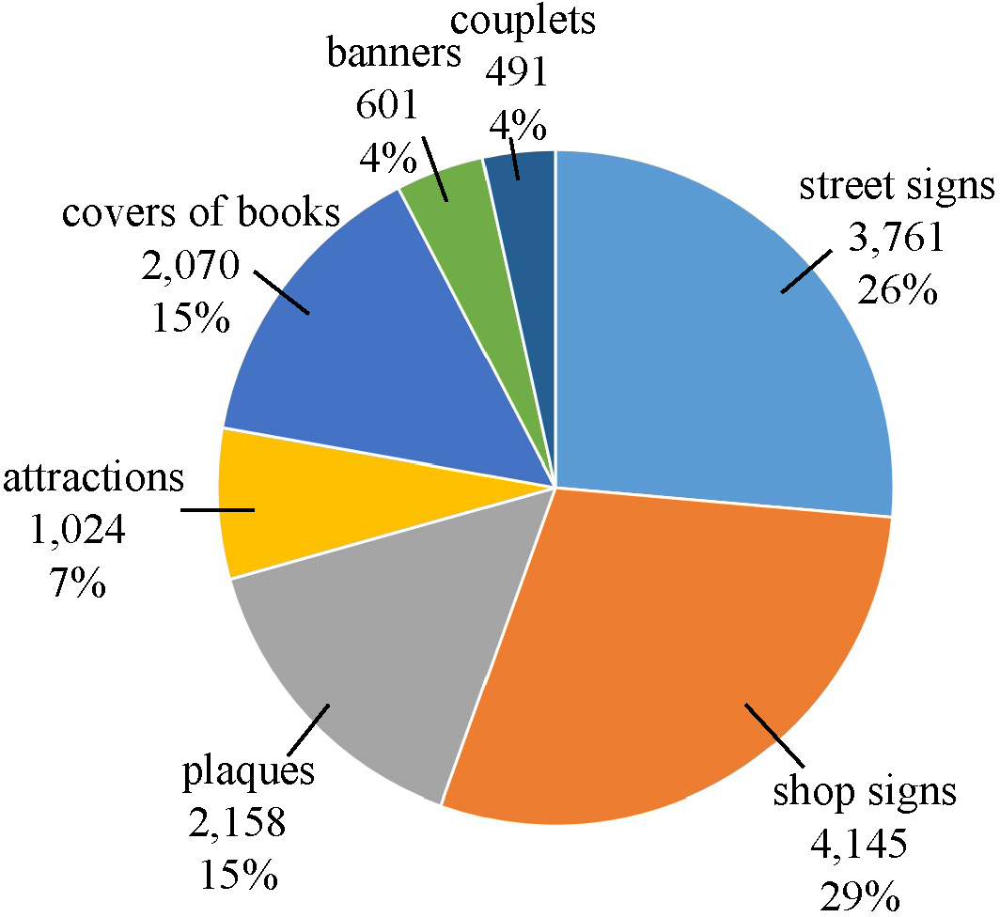

# BTS: A Bi-lingual Benchmark for Text Segmentation in the Wild

This is the repo to host the dataset BTS from the following paper:

[Xixi Xu](), [Zhongang Qi](), [Jianqi Ma](https://github.com/mjq11302010044/), [Honglun Zhang](), [Ying Shan](), [Xiaohu Qie](), **BTS: A Bi-lingual Benchmark for Text Segmentation in the Wild**

**Our dataset is now fully released for academic use.** 
To download the dataset, please send a request email to *15821795091@163.com* to get an agreement and sign.
After verifying your request, we will provide the download link for you.

## Selection of scenes. 
The key motivation of the selection of scenes is to ensure the representation and generalization of the dataset. 
- First, we have images indoor and outdoor to balance the lighting conditions. 
- Second, the text line appearance variety is also an important factor to be considered, i.e., 
text line in different orientation (vertical and horizontal text in couplets and textbooks) and 
curve-shaped (some of the signboards). 
- The third factor lies in the font diversity, e.g., 
we have text images in printed font in textbook and artistic font on the signboard. 

We believe that varieties in these three perspectives can ensure the segmentation model 
to be well-trained with better generalization.

<p align="center">
  
</p>

## Dataset annotation.
BTS eliminate algorithms and out-of-the-box models for the labeling process to prevent some bad labeling cases. 
The annotation workflow is as follows.

- Images cleaning. Unqualified examples such as fuzzy images with unrecognizable characters and strokes will be filtered out.
- Manual annotation. All the images in BTS are manually annotated by humans in three levels, 
including the pixel-level, the character-level, and the line-level annotations. 
PhotoShop is the main tool. The pencil tool in Photoshop is utilized to assist the annotators 
to label pixel-level mask annotations for texts.  
- Two rounds of quality checks. 
During the labeling process, annotators will cross check the annotations from each other; 
after the labeling process, several professional researchers will double check the annotations. 

The designed workflow ensures all annotations to be made in relatively high quality and benchmark to be highly-reliable.

<p align="center">
  
</p>

## Dataset statistics.
BTS contains 14250 images. 

<p align="center">
  
</p>

The distribution is nearly balanced,
which is consistent with real-world distribution.

## Download

A full download should contain these files:

* ```BTS_VAL.zip``` contains 10,188 images.
* ```BTS_TRAIN.zip``` contains 2,696 images.
* ```BTS_TEST.zip``` contains 1,366 images.

In each zip packages, there are three folds.
* ```image``` contains original images.  ```[SceneID]_[SampleID].jpg``` 

* ```bpoly_label``` word-level and char-level labels corresponding to the images.   ```[SceneID]_[SampleID]_anno.json``` 

* ```semantic_label``` mask labels corresponding to the images.   ```[SceneID]_[SampleID]_maskfg.png``` 

In this table, we compare BTS with a variety of representative datasets. 

<font size="11" face="Courier New">
<table>
  <tr>
    <td colspan="1">Dataset</td>
    <td colspan="1">Text Type</td>
    <td colspan="1">Images</td>
    <td colspan="1">Words</td>
    <td colspan="1">Chars</td>
    <td colspan="1">Masks</td>
    <td colspan="1">Char Classes</td>
    <td colspan="1">Language</td>
  </tr>
  <tr>
    <td>ICDAR13 FST</td>
    <td>Scene</td>
    <td>462</td>
    <td>1944</td>
    <td>6620</td>
    <td>Word,Char</td>
    <td>36</td>
    <td>English</td>
  </tr>
  <tr>
    <td>COCO_TS</td>
    <td>Scene</td>
    <td>14690</td>
    <td>139034</td>
    <td>-</td>
    <td>Word</td>
    <td>36</td>
    <td>English</td>
  </tr>
  <tr>
    <td>MLT_S</td>
    <td>Scene</td>
    <td>6896</td>
    <td>30691</td>
    <td>-</td>
    <td>Word</td>
    <td>36</td>
    <td>English</td>
  </tr>
  <tr>
    <td>Total-Text</td>
    <td>Scene</td>
    <td>1555</td>
    <td>9330</td>
    <td>-</td>
    <td>Word</td>
    <td>36</td>
    <td>English</td>
  </tr>
  <tr>
    <td>TextSeg</td>
    <td>Scene+Design</td>
    <td>4024</td>
    <td>15691</td>
    <td>73790</td>
    <td>Word,Word-Effect,Char</td>
    <td>36</td>
    <td>English</td>
  </tr>
  <tr>
    <td><b>BTS(Ours)</b></td>
    <td>Scene</td>
    <td>14250</td>
    <td>44280</td>
    <td>209090</td>
    <td>Word,Char</td>
    <td>3985</td>
    <td>Bi-lingual</td>
  </tr>
</table>
</font>


## Acknowledgements


